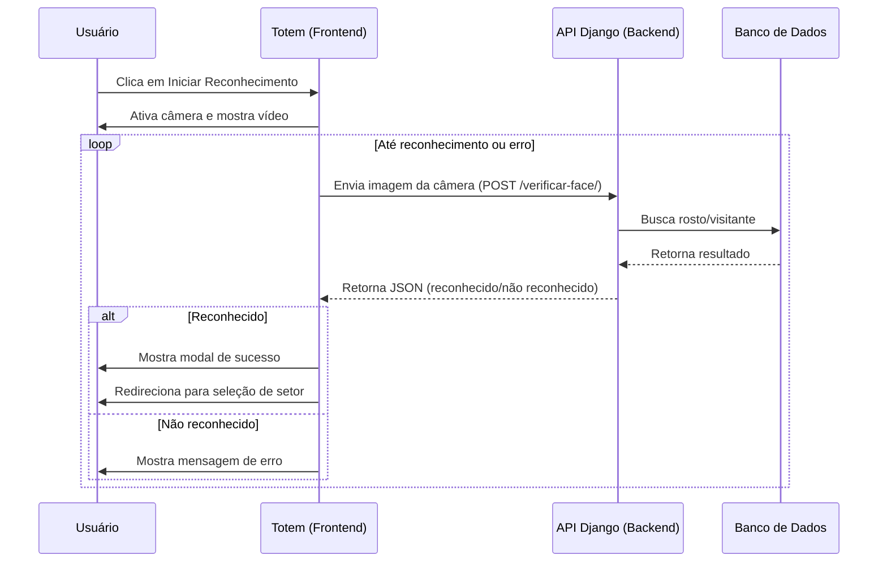
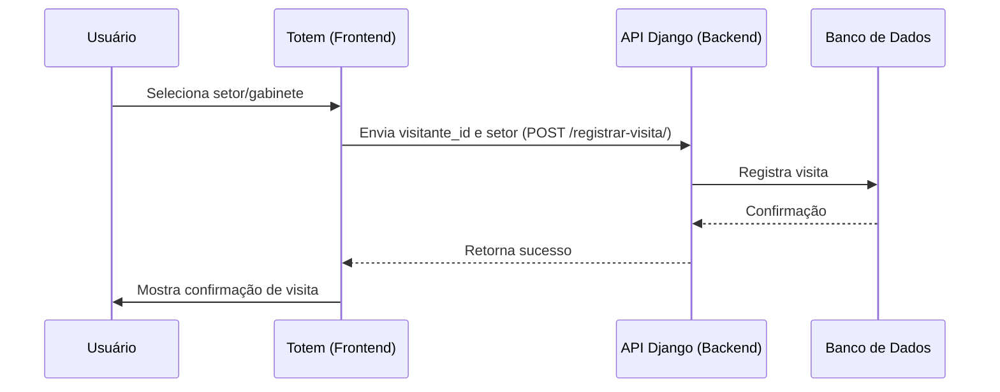

# Estrutura das Páginas do Totem de Visitas

## 1. Página `/recepcao/totem/`

### Objetivo
Interface de totem para identificação de visitantes via reconhecimento facial, com experiência otimizada para uso em quiosques.

### Estrutura HTML
- **Botão Voltar para Recepção**: Fora do card, alinhado à direita, sobre o fundo cinza claro.
- **Card Central Branco**: Contém título, área de vídeo, mensagens e botões.
- **Área de Vídeo**: Mostra a câmera do usuário, com guia oval amarelo para posicionamento do rosto.
- **Mensagens de Status**: Feedback visual sobre o processo.
- **Botões**:
  - Reiniciar Câmera
  - Iniciar Reconhecimento (só ativa o reconhecimento facial ao clicar)

#### Exemplo de Estrutura HTML
```html
<div class="container-fluid bg-light vh-100">
  <div class="d-flex justify-content-end"> <!-- Botão Voltar -->
    <a href="..." class="btn btn-light btn-xs">Voltar para Recepção</a>
  </div>
  <div class="card ..."> <!-- Card Central -->
    <h2>Posicione seu rosto para identificação</h2>
    <div class="camera-area-totem">...</div>
    <div class="status-mensagens">...</div>
    <button>Iniciar Reconhecimento</button>
  </div>
</div>
```

### Fluxo JS
- Ao carregar, ativa a câmera.
- Só inicia o reconhecimento facial ao clicar em "Iniciar Reconhecimento".
- Envia frames para o backend apenas quando solicitado.
- Mostra modal de sucesso ao reconhecer, ou mensagens de erro caso não detecte rosto.
- **Principais funções:**
  - `startCamera()`: ativa a webcam.
  - `capturarReconhecer()`: captura frame e envia para API.
  - `mostrarModalSucesso()`: exibe modal de boas-vindas.

#### Dica de Acessibilidade
- Use `aria-live="polite"` para mensagens dinâmicas.
- Garanta contraste suficiente entre texto e fundo.
- Botões grandes e fáceis de clicar.

### CSS e Responsividade
- Layout responsivo, card centralizado, área de vídeo com borda azul e guia oval amarelo.
- Botões coloridos, acessíveis e com ícones.
- Use media queries para adaptar o tamanho do card e vídeo em telas pequenas.

#### Exemplo de CSS Responsivo
```css
@media (max-width: 600px) {
  .camera-area-totem { width: 98vw; height: 60vw; }
  .totem-video { width: 100%; height: 100%; }
}
```

### Integração Backend
- **Endpoint `/recepcao/api/verificar-face/`**: Recebe imagem, retorna se o rosto foi reconhecido e dados do visitante.
- **Endpoint `/recepcao/api/cadastro-rapido/`**: Cadastra rosto não reconhecido para posterior registro.
- **Redirecionamento**: Após sucesso, avança para `/recepcao/totem/setor/?visitante_id=...`.

#### Exemplo de chamada fetch
```js
fetch('/recepcao/api/verificar-face/', { method: 'POST', body: formData })
```

---

## 2. Página `/recepcao/totem/setor/`

### Objetivo
Permitir ao visitante reconhecido escolher o setor/gabinete para registrar sua visita.

### Estrutura HTML
- **Card Central**: Exibe dados do visitante (nome, foto, documento).
- **Lista de Setores/Gabinetes**: Botões ou cards para seleção.
- **Botão Confirmar Visita**: Finaliza o registro da visita.

### Fluxo JS
- Recebe o visitante_id via query string.
- Exibe dados do visitante e opções de setor/gabinete.
- Ao selecionar e confirmar, envia para o backend registrar a visita.

#### Exemplo de fluxo
```js
// Ao clicar em um setor
document.querySelectorAll('.btn-setor').forEach(btn => {
  btn.addEventListener('click', function() {
    // Envia visitante_id e setor para o backend
  });
});
```

### Integração Backend
- **Endpoint para buscar dados do visitante**: Recebe visitante_id, retorna dados pessoais e foto.
- **Endpoint para registrar visita**: Recebe visitante_id e setor/gabinete, registra a visita.

---

## 3. Vinculação com Backend (Django)
- **Views**: Funções ou classes em `views.py` que renderizam os templates e processam as requisições AJAX/POST.
- **URLs**: Registradas em `urls.py` do app `recepcao`.
- **Templates**: Localizados em `templates/recepcao/totem.html` e `templates/recepcao/totem_setor.html`.
- **APIs**: Endpoints REST para reconhecimento facial e cadastro rápido.
- **Mensagens**: Retornos em JSON para o frontend exibir feedback ao usuário.

---

## 4. Fluxo Resumido
1. Visitante se posiciona no totem e clica em "Iniciar Reconhecimento".
2. Se reconhecido, modal de sucesso e avança para seleção de setor.
3. Se não reconhecido, mensagem de erro ou redirecionamento para cadastro.
4. Visitante seleciona setor/gabinete e confirma visita.
5. Backend registra a visita e exibe confirmação.

---

## 5. Arquivos Relacionados
- `templates/recepcao/totem.html`
- `templates/recepcao/totem_setor.html`
- `static/js/` (separação recomendada para JS customizado)
- `views.py` e `urls.py` do app `recepcao`
- Endpoints de API para reconhecimento/cadastro

---

## 6. Dicas de Manutenção e Segurança
- Separe o JS customizado em arquivos próprios para facilitar manutenção.
- Valide e sanitize todas as entradas do usuário no backend.
- Use autenticação e autorização nas APIs.
- Garanta que endpoints só aceitem métodos HTTP corretos (POST para envio de imagens, GET para busca de dados).
- Sempre trate erros com mensagens amigáveis e claras para o usuário.
- Teste responsividade e acessibilidade em diferentes dispositivos.

---

## 7. Diagramas de Fluxo (Frontend e Backend)

### Fluxo de Reconhecimento Facial (Frontend → Backend)



### Fluxo de Registro de Visita (Setor)



---

> **Dica:** Você pode visualizar esses diagramas usando extensões Mermaid em editores como VSCode, Obsidian ou online em https://mermaid.live/

# Estrutura DEV - Templates do Totem Facial (SIGEPE)

## 1. Organização dos Templates

A partir de 2024, todos os templates do fluxo do Totem Facial foram movidos para a pasta dedicada:

```
templates/toten_facial/
├── totem.html                  # Tela principal do totem (reconhecimento facial)
├── totem_home.html             # Tela inicial do totem (escolha: fazer/finalizar visita)
├── totem_selecionar_setor.html # Seleção de setor/gabinete após reconhecimento
├── cadastro_visitantes.html    # Cadastro de visitante (caso não reconhecido)
├── totem_finalizar_visita.html # Finalização de visita via reconhecimento facial
├── totem_visita_finalizada.html# Confirmação de visita finalizada
```

- **Todos os arquivos do fluxo do totem estão centralizados nesta pasta.**
- Não há mais duplicidade com a pasta `templates/recepcao`.

## 2. Padrão Visual e Usabilidade

- **Layout coluna única, card centralizado, largura máxima 480px**
- **Fundo gradiente azul/roxo** para profundidade
- **Elementos grandes, touch-friendly** (inputs, botões, selects)
- **Fonte grande (18px+)** para leitura confortável em tablets
- **Espaçamento generoso** e contraste alto
- **Responsivo para tablets** (media queries)
- **Sem scroll horizontal**
- **Stepper/indicador de etapas** no topo das telas multi-etapas
- **Feedback visual claro** (mensagens, cores, loading)

## 3. Boas Práticas de Manutenção

- **Sempre criar novos templates do totem dentro de `toten_facial/`**
- **Reutilizar o bloco de CSS base** (copiar de `totem.html` para novos arquivos)
- **Evitar includes/extensões cruzadas com outras pastas**
- **Testar em tablets reais e emuladores**
- **Usar nomes de arquivos e variáveis claros e consistentes**
- **Manter o padrão de acessibilidade** (labels, contraste, foco visível)

## 4. Integração com Backend

- As rotas e APIs continuam sob o prefixo `/recepcao/` (ex: `/recepcao/api/verificar-face/`)
- Os templates apenas mudaram de pasta, não de URL
- As views Django já foram atualizadas para renderizar os templates do novo diretório

## 5. Como Expandir

- Para adicionar novas etapas ou telas, crie o arquivo em `toten_facial/` e siga o padrão visual
- Para alterar o visual, edite o bloco `<style>` dos templates do totem
- Para integrações JS, mantenha o padrão de feedback visual e acessibilidade

## 6. Checklist para DEV

- [ ] Novo template criado em `toten_facial/`
- [ ] CSS copiado do padrão do totem
- [ ] Testado em tablet (responsividade, touch)
- [ ] Sem includes/extensões cruzadas
- [ ] Feedback visual e acessibilidade ok
- [ ] Integração com backend testada

---

**Dúvidas ou sugestões? Fale com o time de Frontend/UX!**